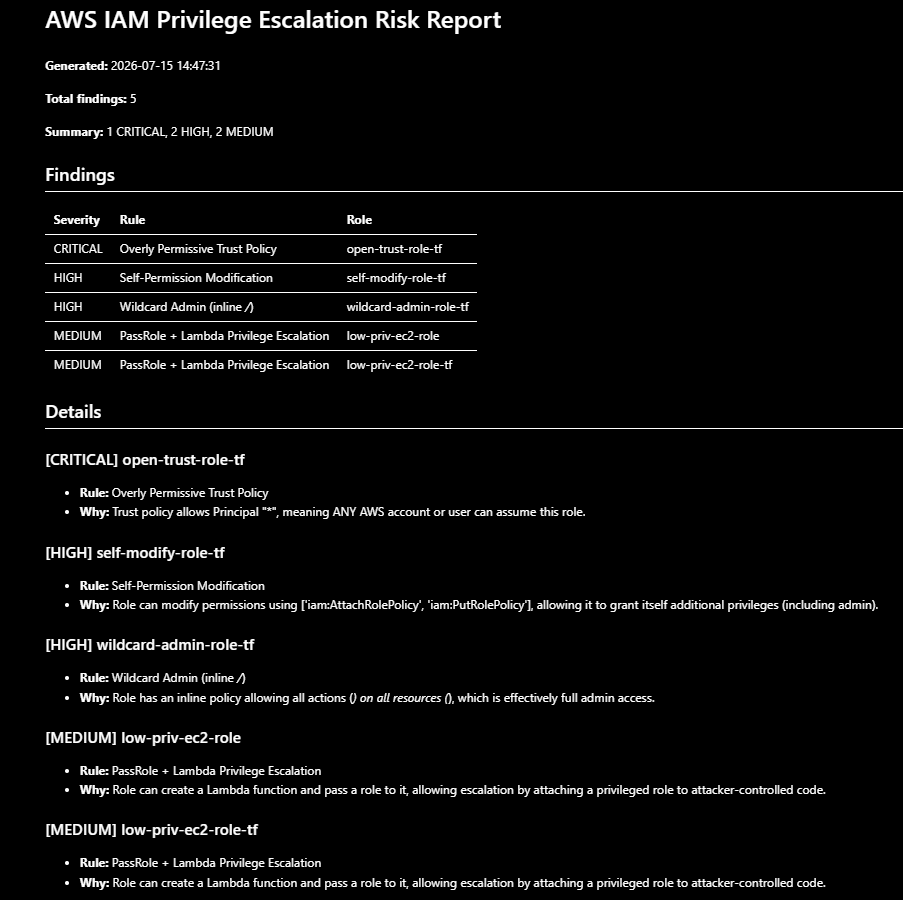

# AWS IAM Privilege Escalation & Misconfiguration Risk Analyzer

A Python tool that scans an AWS account's IAM roles for privilege-escalation
paths and dangerous misconfigurations, then generates a severity-ranked risk report.

## The Problem

In a real AWS environment, a single account can hold hundreds or thousands of IAM
roles. Individually harmless-looking permissions can combine into privilege-escalation
paths — a low-privileged identity quietly gaining a route to full admin access. These
paths are nearly impossible to spot by hand at scale, and they're a leading cause of
cloud breaches.

This tool automates that analysis: it enumerates every role in an account, checks each
against known escalation and misconfiguration patterns, scores the risk, and produces
a prioritized report showing what to fix first.

## How It Works

The tool runs as a three-stage pipeline:
1. **Collect** (`analyzer/collector.py`) — Uses the AWS SDK (boto3) to enumerate every
   IAM role in the account, pulling each role's trust policy, inline policies, and
   attached managed policies.

2. **Detect & Score** (`analyzer/detector.py`) — Runs each role through four detection
   rules. Every finding is assigned a severity (CRITICAL / HIGH / MEDIUM) based on impact
   and exploitability, and findings are sorted most-severe-first.

3. **Report** (`analyzer/report.py`) — Outputs a machine-readable JSON report and a
   human-readable Markdown report with a severity summary, findings table, and details.

## Detection Rules

| # | Rule | Severity | What it catches |
|---|------|----------|-----------------|
| 1 | PassRole + Lambda | MEDIUM | A role that can create a Lambda *and* pass a role to it — letting it attach a privileged role to attacker-controlled code. |
| 2 | Self-Permission Modification | HIGH | A role that can edit its own permissions (e.g. `iam:AttachRolePolicy`), letting it grant itself admin. |
| 3 | Wildcard Admin | HIGH | An inline policy allowing all actions on all resources (`*`/`*`) — effectively admin. |
| 4 | Overly Permissive Trust Policy | CRITICAL | A trust policy allowing `Principal: "*"` — meaning *anyone* can assume the role. |

Rules 1–3 inspect what a role **can do** (its permissions). Rule 4 inspects who **can
assume** the role (its trust policy) — a distinct and often-overlooked attack surface.

## Running the Tool

### Prerequisites
- An AWS account with credentials configured (`aws configure`)
- Python 3.12+
- Terraform (only needed to deploy the test lab)

### Setup
```bash
git clone https://github.com/oladimejiaeboyecyber/aws-iam-risk-analyzer.git
cd aws-iam-risk-analyzer

python -m venv venv
.\venv\Scripts\Activate      # Windows
# source venv/bin/activate   # macOS/Linux

pip install -r requirements.txt
```

### (Optional) Deploy the vulnerable test lab
The `infra/` directory contains Terraform that provisions deliberately-vulnerable IAM
roles — one per detection rule — so you can see the analyzer catch real findings.

```bash
cd infra
terraform init
terraform apply    # type 'yes' to confirm
cd ..
```

### Run the analyzer
```bash
python analyzer/report.py
```

This generates `reports/risk-report.json` and `reports/risk-report.md`.

## Sample Output



## What I Learned

This project took me from IAM fundamentals to a working cloud-security tool: writing
trust and permission policies, manually performing a real privilege escalation (PassRole
+ Lambda), defining infrastructure as code with Terraform, and building an analyzer in
Python (boto3) that detects and prioritizes IAM risks automatically.